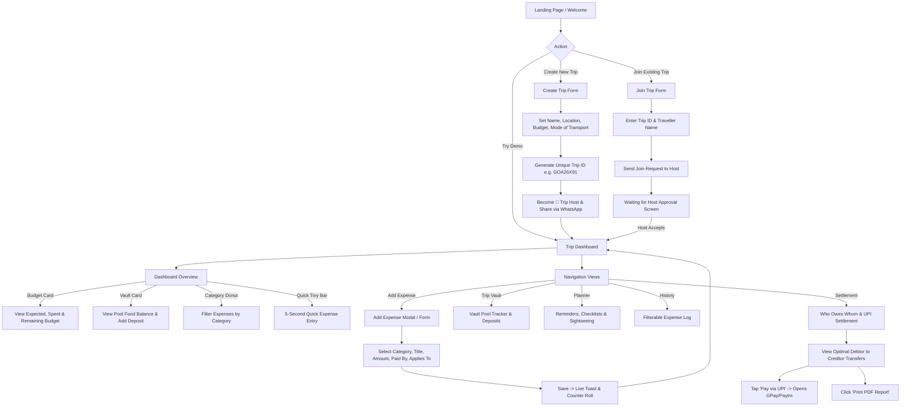

# 🗺️ User Flow: शुभ यात्रा (Shubh Yatra)

This document maps out the complete user journey and app experience from a traveller's perspective.

---

## 📱 User Flow Map

---

## 👤 Step-by-Step Experience

### 1. Landing Page & Discovery
- **Hero Banner**: Devanagari logo **"शुभ यात्रा"**, subtitle *"Shubh Yatra"*, and tagline *"Every Trip. Every Rupee. Accounted For."*
- **Parallax Background**: Sunset mountain road backdrop with glassmorphic cards and 60fps custom magnetic cursor.
- **Interactive Money Jar**: Tappable tiny expense chips (Toll ₹120, Water ₹40, Chai ₹90, Parking ₹50, Petrol ₹250) that drop into an interactive glass jar with live count-up sum. Editable price badges allow customizing amounts.
- **Action Buttons**: `Create Trip`, `Join Trip`, and `Goa 2026 Demo 🏖️`.

### 2. Creating a Trip (Host Journey)
- The user fills out: Trip Name, Destination, Start Location, Dates, Transport Mode (*Car, Train, Bus, Flight, Bike*), and Expected Budget.
- Upon submission:
  - Generates a unique 8-character Trip ID (e.g. `GOA26X91`).
  - Confetti burst animation fires.
  - Generates a celebratory card with a 1-tap **Copy Trip ID** and **Share on WhatsApp** button.
  - The creator becomes the **👑 Trip Host** with administrative approval controls.

### 3. Joining a Trip (Member Journey)
- The user enters the Trip ID shared by their host, their name, and mobile number.
- Clicks `Request to Join`.
- Displays a *"Waiting for Host Approval ⏳"* notification screen. (Trip ID alone does not grant instant entry for privacy & security).
- **Host Approval**: Host opens `Approvals` modal, reviews applicant details, and taps `Accept ✅`. Confetti fires and the member enters the active trip.

### 4. Main Trip Dashboard
- **Header**: Trip details, transport badge, destination, dates, and member avatars.
- **Budget Summary Card**: Displays Expected Budget, Total Spent, and Remaining Budget with an animated color-changing progress ring (*Green <75%*, *Amber 75–99%*, *Red Pulse ≥100%*).
- **Trip Vault Card**: Shows total pool contributions, spent pool funds, and remaining vault balance.
- **Category Donut Chart**: Interactive Recharts chart displaying Travel, Fooding, Hotel, Activity, and Other breakdown.
- **Quick Tiny Expenses Bar**: Prominent big emoji chips for 5-second roadtrip entries.

### 5. Adding an Expense
- Form fields: Title, Amount, Category, Paid By (single member selection), Applies To (multi-select member chips + *"Select All / Split Equally"* shortcut).
- Checkbox option: *"Pay from Trip Vault 💰"*.
- Preset 5-second quick chips bar pre-fills common roadtrip items.
- On save, triggers a celebratory toast and live odometer counter update.

### 6. Trip Vault Management
- Displays per-member pool contributions and total remaining pool balance.
- Modal to deposit additional pool funds.
- History log of all expenses paid out of the vault.

### 7. Trip Planner
- **Host Mode**: Full edit permissions to add reminders, checklists, and places to visit.
- **Member Mode**: Read-only access with a 🔒 lock indicator.
- **Tabs**:
  - *Reminders*: Flight/train departures, hotel check-ins.
  - *Checklists*: IDs, tickets, packing items with completion strike-through.
  - *Places to Visit*: Tourist spots with visited toggle.

### 8. Expense History & Search
- Search bar to filter by title, category, or payer.
- Category filter pills (*Travel, Fooding, Hotel, Activity, Other*).
- *"Tiny Expenses Only"* filter toggle.
- Expandable expense cards showing member share breakdown and delete action.

### 9. Final Summary & Settlement
- Overview of Total Spent, Vault Balance, and Per-Member Average.
- **"Who Owes Whom" Settlement Cards**: Calculates minimal transaction count between debtors and creditors.
- **Pay via UPI**: Direct `upi://pay?pa=...` links for 1-tap settlement.
- **Print PDF Report**: Browser print generator for offline records.
